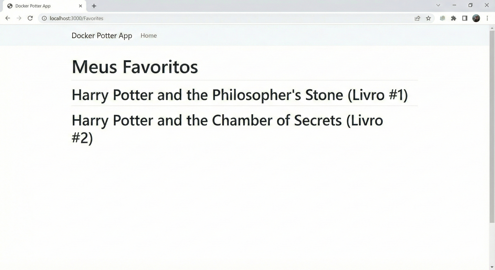
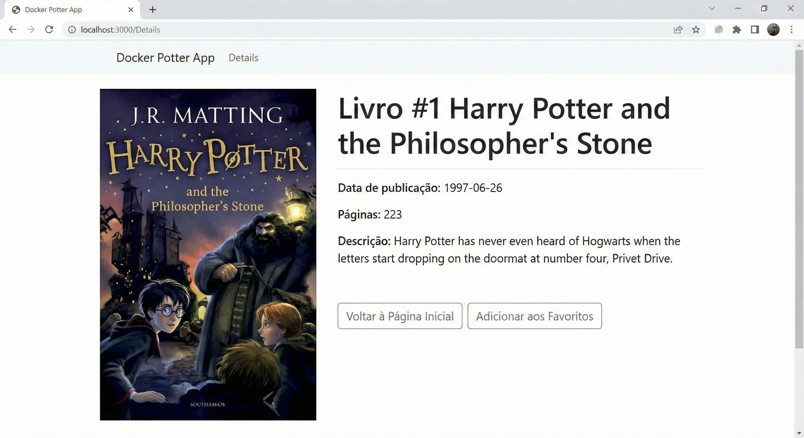
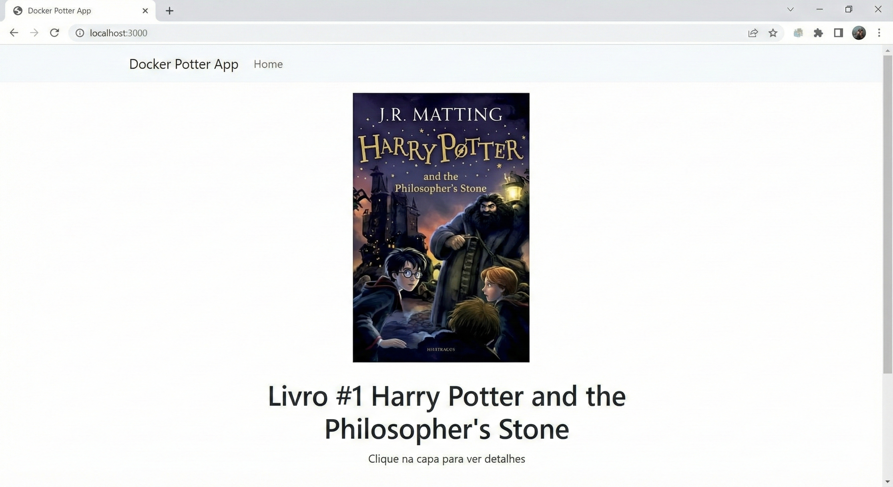

# Docker Potter App

Este projeto é uma aplicação completa em containers Docker que consome a API pública do Harry Potter (PotterAPI) e permite aos usuários visualizar detalhes de livros aleatórios e salvar seus favoritos em um banco de dados local.

Desenvolvido como atividade prática da disciplina de **DevOps Tools**.

## 🚀 Tecnologias Utilizadas

A aplicação foi construída utilizando a seguinte stack tecnológica:

* **Frontend:** React (Node.js 20 base) - Diretório `docker_potter_web`
* **Backend:** Python 3.13 com FastAPI - Diretório `docker_potter_api`
* **Banco de Dados:** PostgreSQL 14
* **Orquestração:** Docker Compose

## 📋 Pré-requisitos

* Docker Engine instalado
* Docker Compose instalado
* Git instalado

## 🔧 Como Executar o Projeto

1. **Clone o repositório:**
   ```bash
   git clone [https://github.com/w3sll3ym/docker_potter_app.git](https://github.com/w3sll3ym/docker_potter_app.git)
   cd docker_potter_app

## Prints da Aplicação

      
